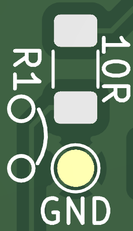

# VIK Bare Display adapter

Small adapter for bare LCD displays to [VIK](https://github.com/sadekbaroudi/vik) connector.

## Features

- horizontal or vertical VIK connector (FPC)
- automatic reset (no separate pin)
- two mounting holes for solder nuts
- testing pads

## Supported displays

Theoretically any display with 12pin welding type FPC with this pin out:

```
- GND
- LEDK
- LEDA
- VDD
- GND
- GND
- DC
- CS
- SCL
- SDA
- RESET
- GND
```

Bare displays can be used with any PCB size, but they are pretty fragile without any support, so be careful.

Existing PCBs for specific sizes:

- 1.28" round display ([example](https://www.aliexpress.com/item/1005006051175539.html))
- universal **0.7mm** pitch / 1.47" rectangular display ([example](https://www.aliexpress.com/item/1005004833011998.html))
- universal **0.8mm** pitch ([example](https://www.aliexpress.com/item/1416043398.html))

## Forced backlight

If controlled backlight is not needed (for example no GPIO2 on VIK), GND testing pad can be bridged to R1 bottom pad, for 100% backlight. In that case S8050 and R1 parts are not needed.



## Photos


## BOM

All SMD components are 1206 size

- 10R resistor
- 100k resistor
- 1uF capacitor
- 100nF capacitor
- S8050 transistor
- 12pin FFC connector vertical/horizontal (both can be soldered in the same time)

## VIK module certification

| Category                | Classification       | Response           |
| ----------------------- | -------------------- | ------------------ |
| FPC connector           | Required             | :heavy_check_mark: |
| Breakout pins           | Recommended          | :x:                |
| Uses: SPI               | Optional             | :heavy_check_mark: |
| SPI used for SPI only   | Strongly recommended | :heavy_check_mark: |
| Uses: I2C               | Optional             | :x:                |
| I2C used for I2C only   | Strongly Recommended | N/A                |
| I2C pull ups            | Required             | N/A                |
| Uses: RGB               | Optional             | :x:                |
| Uses: Extra GPIO 1      | Optional             | :heavy_check_mark: |
| Uses: Extra GPIO 2      | Optional             | :heavy_check_mark: |
| Standard PCB Size/Mount | Strongly recommended | :x:                |

## Used projects and resources

- https://www.waveshare.net/w/upload/f/f5/1.47inch_LCD_Module_SchDoc.pdf
- https://hackaday.io/project/168130-universal-ips-display-breakout-board
- 1.47" LCD model https://grabcad.com/library/1-47-rgb-tft-lcd-screen-display-module-172-320-ips-screen-st7789-driver-8pin-1
- 1.28" round LCD model https://grabcad.com/library/1-28-lcd-ga9a01-1
